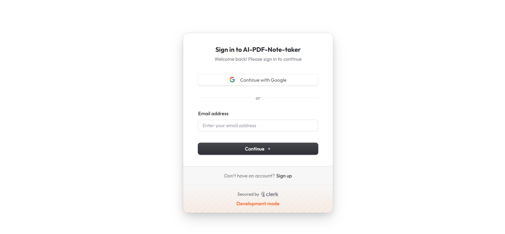
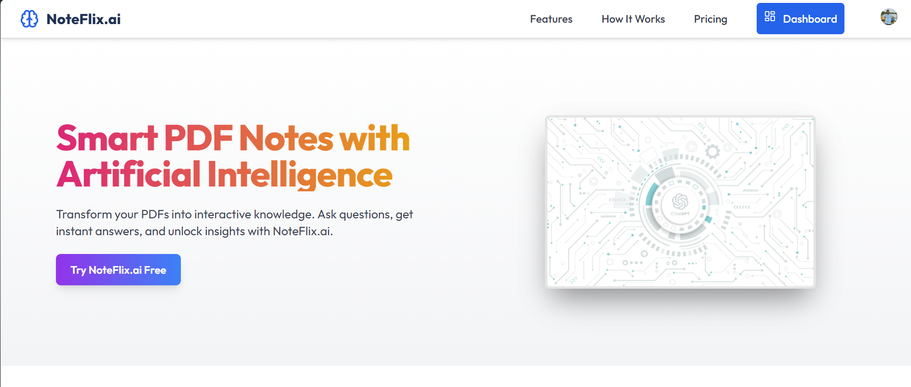
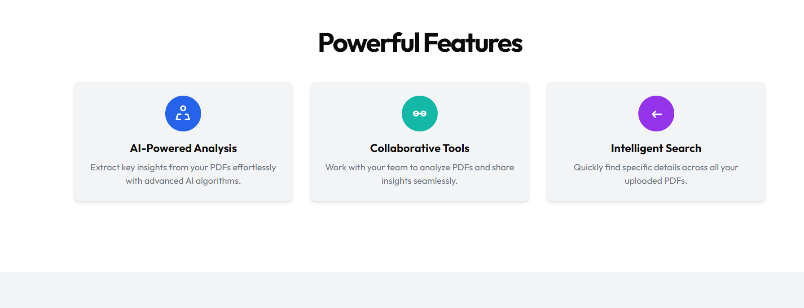
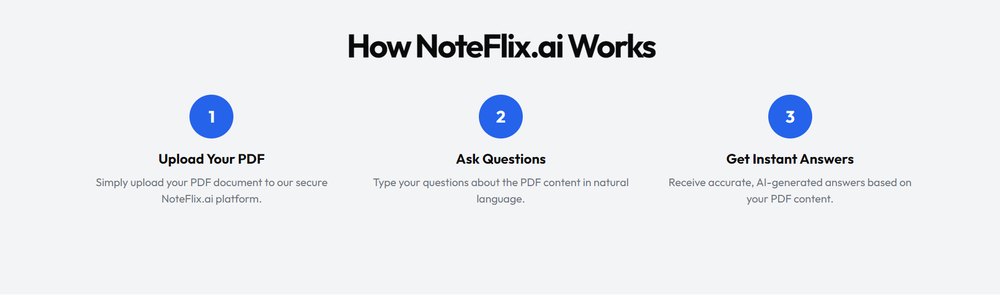
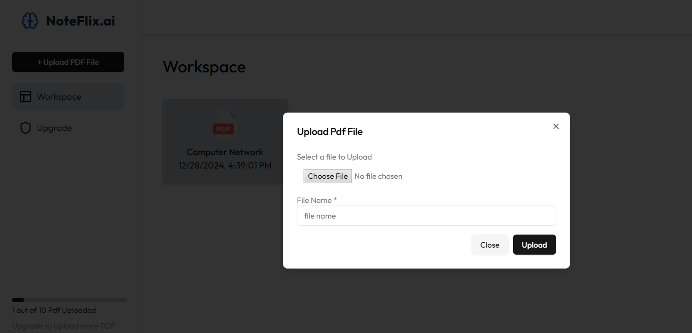
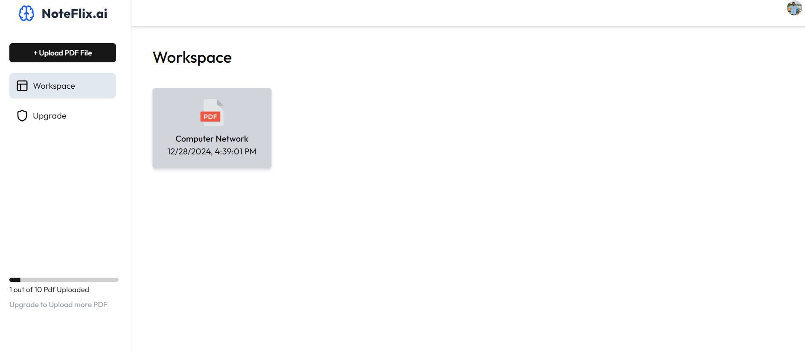
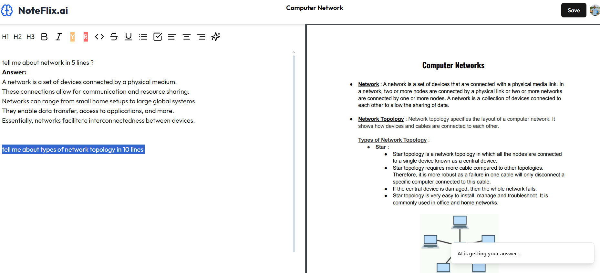
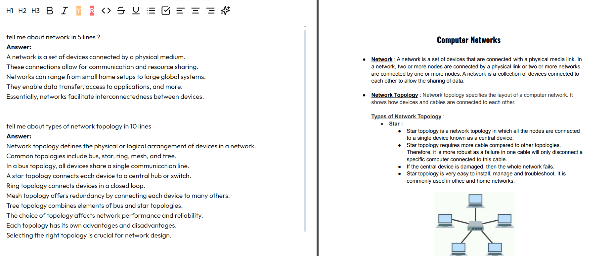

# AI-Powered PDF Notes Making App ✍️📚

An advanced Full Stack application for extracting and making notes from PDFs using AI. Built with modern technologies, this app leverages artificial intelligence to provide a seamless note-taking experience, with persistent storage, user-friendly design, and subscription plans.

## 🌟 Features

- **AI-Powered Notes** : Extract notes directly from PDFs using the Gemini AI model.
- **Authentication** : Secure login and registration with Clerk.
- **PDF Processing** : Split PDFs into chunks and store them in a Convex database.
- **Vector Embedding** : Efficiently search and retrieve data from stored files.
- **Payment Gateway** : Integrated PayPal for upgrading plans.
- **Persistent Notes** : Save and access notes anytime.

## 🚀 Technologies Used

- **Next.js** : Framework for server-rendered React applications.
- **Tailwind CSS** : For modern, responsive UI design.
- **Clerk** : User authentication service.
- **Convex** : Real-time database for splitting and storing PDF data.
- **LangChain** : Text processing and embedding.
- **Gemini AI** : Advanced AI model for generating insights.
- **PayPal** : For seamless subscription and payment handling.

## 📸 Screenshots

Add your app screenshots here:

1. **Login Page**
   
2. **Homr Page**
   
   
   

3. **PDF Upload and Processing**
   
   

4. **AI Notes Interface**
   

5. **Saved Notes Section**
   
6. **Subscription Plan**
   

## 🌐 Live Demo

[Live Application](https://ai-notes-taking-app.vercel.app/)

## 🛠️ How to Use

1. Clone the repository:
   ```bash
   https://github.com/AshutoshRajGupta/AI_Notes_taking_App.git
   ```
2. Install dependencies:
   ```bash
   npm install
   ```
3. Set up the environment variables (see below).
4. Start the development server:
   ```bash
   npm run dev
   ```
5. Access the app at `http://localhost:3000`.
6. for running the convex database:
   ```bash
   npx convex dev
   ```

## 🗂️ Environment Variables

Create a `.env.local` file in the root directory with the following variables:

- CONVEX_DEPLOYMENT=
- NEXT_PUBLIC_CONVEX_URL=
- NEXT_PUBLIC_CLERK_PUBLISHABLE_KEY=
- CLERK_SECRET_KEY=
- NEXT_PUBLIC_CLERK_SIGN_IN_URL=
- NEXT_PUBLIC_CLERK_SIGN_UP_URL=
- NEXT_PUBLIC_GEMINI_API_KEY=
- NEXT_PUBLIC_PAYPAL_CLIENT_ID=

## 🛠️ How it Works

1. Upload a PDF to the app.
2. The PDF is split into text chunks using Convex and stored in the database.
3. Vector embeddings are created for efficient data retrieval.
4. Use the Gemini AI model to extract notes, match the query from the vector embedding from database and gain insights from the document.
5. Save notes, upgrade the plan, or explore additional features.

---

Feel free to modify the content based on your app's specifics!
